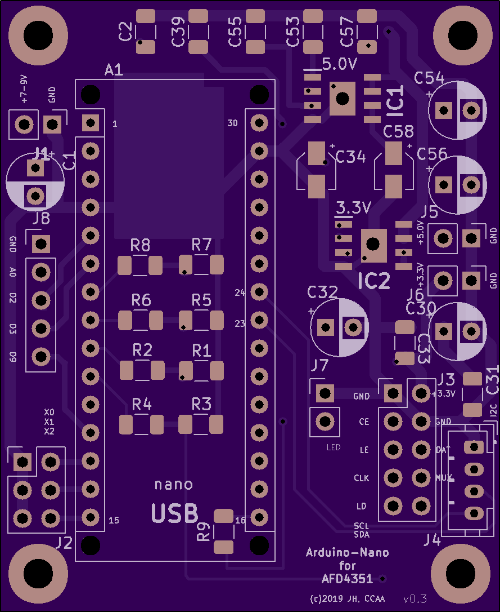

# ArduinoNano for ADF4351

## Handy tool for flexible configuration of ADF4351

An Arduino Nano is used to set ADF4351 Registers to determine the
Synthesizers output frequency.

### Software License

The ard4adf.ino file is licensed under the terms of
GNU General Public License version 3 or later.

For KiCAD the footprint and library modules of the voltage-regulator
chips are found on the net with unknown licenses, so they are not
included here. Files in the kicad directory are 'Open Source' under
the terms of the definition for Open Source Hardware Association.

    http://www.oshwa.org/definition/

## Arduino sketch

Host (DK2KA) build various Synthesizer solutions – based on
handwired hardware PoC for GHz Beacons, AO 100 and 10 GHz EME HAM
Radio Devices – Arduino Sketches included.
Wolf (DF7KB) suggested modifications to ease assembling the PCBs,
especially to create a backpack solution that fits exactly onto
the Synthesizer breakout board.

A solution to select a variety of frequencies from the Synthesizer
has been added.  Aim was to generate Local Oscillator frequencies
for Transverters, synchronizing them with GPS and therefore
preparing the HAM Equipment for frequency accuracy and weak signal
operations.

The Sketch was transformed into an „easyly readable code“ to allow
adaptations on the fly.

Finally the ADF4351 evaluation board was extended with the Arduino
NANO Hardware to create a handy solution to set the synthezisers
registers. At the same time debugging elements have been added.

### Compiling and debugging - Sketch: ard4adf.ino

The ard4adf.ino can be compiled and loaded into an Arduino-Nano.

#### Debug via Serial Monitor

For testing just use the serial monitor of ardunio-IDE, if
the line

    //#define DEBUG_VIA_SERIAL

is uncommented at compile time.

#### Debug via Blinking Arduino Led

Another useful debugging feature is implented by using the led on the
arduino board. Repeating one second led-on mean the LE pin is low, so
ADF4351 is signaling PLL sync is lost. Short flickers should be
counted after a three second pause, the number indicates the jumpers
reading and so you can easily read the frequency on ADF4351 outputs
(in a binary way).

There are 3 jumpers read as 3 bits, so its 0 .. 7, 8 possible settings.
Jumper set means bit is set to low. Jumper not set means bit is set to
high.

    1 flicker and 3 sec pause <==> jumpers are evaluated to 0.
    2 flickers and 3 sec pause <==> jumpers are evaluated to 1
    ...
    8 flickers and 3 sec pause <==> jumper s are evaluated to 7

The flickering is always on.

## KiCAD-PCB

The KiCAD schema and PCB-layout may be found in the directory kicad.
**ADM7150ARDZ-3.3** and **ADM7150ARDZ-5.0** are voltage regulators
used to achieve  low noise power supplies on the arduino and the
ADF4351 chips. The board may be powered with some 6 to 7 V DC. It
is assembled in a mixture of conventional and SMD parts.

Have fun!
